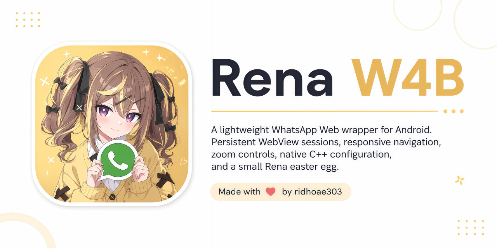

<p align="center">
  
</p>

<h1 align="center">Rena W4B</h1>

<p align="center">
A lightweight WhatsApp Web wrapper for Android. Persistent WebView sessions, responsive navigation, zoom controls, native C++ configuration, and a small Rena easter egg.
</p>

<p align="center">
  
  
  
  
  
</p>

## What is this?

Rena W4B is basically WhatsApp Web packed into a native Android shell.

No extra browser tab, no bouncing between apps. The UI is native Android, while WhatsApp Web runs inside Chromium WebView.

The project also has a native C++ layer for protected config strings and app integrity checks.

### Preview

<table>
  <tr>
    <td align="center" width="50%">
      
    </td>
    <td align="center" width="50%">
      
    </td>
  </tr>
  <tr>
    <td align="center" width="50%">
      
    </td>
    <td align="center" width="50%">
      
    </td>
  </tr>
  <tr>
    <td align="center" width="50%">
      
    </td>
    <td align="center" width="50%">
      
    </td>
  </tr>
</table>


## Download

Want to grab the latest APK? Head over to the [GitHub Releases](https://github.com/ridhoae303/Rena-w4b/releases).

That's where the official builds are posted. Open the release you want, check the assets, and grab the APK from there.

### Preview

<table>
  <tr>
    <td align="center" width="50%">
      
    </td>
    <td align="center" width="50%">
      
    </td>
  </tr>
  <tr>
    <td align="center" width="50%">
      
    </td>
    <td align="center" width="50%">
      
    </td>
  </tr>
  <tr>
    <td align="center" width="50%">
      
    </td>
    <td align="center" width="50%">
      
    </td>
  </tr>
</table>


## Download

Want to grab the latest APK? Head over to the [GitHub Releases](https://github.com/ridhoae303/Rena-w4b/releases).

That's where the official builds are posted. Open the release you want, check the assets, and grab the APK from there.

## Features

- WhatsApp Web inside a dedicated Android WebView
- Per-tab WebView profiles with isolated cookies and web storage
- Per-tab session persistence
- Tab switching without intentionally destroying the WebView instance
- Session-state flushing on lifecycle changes
- Manual page refresh without intentionally clearing the login session
- Dedicated **Check for Updates** action with its own icon resource
- Dedicated **Refresh** action with its own separate icon resource
- Zoom mode toggle
- WhatsApp Web downloads through Android's download flow
- Camera and microphone permission handling
- Android 13+ notification permission support
- Optional battery optimization prompt for long-running sessions
- Fullscreen / immersive UI
- Hardware-accelerated WebView rendering
- Data Manager for profile cookies, Web Storage, cache, and related web data
- Native application integrity gate
- Native C++ string/config protection through `EasyObfuse`
- GitHub, Telegram, community, and donation links
- Rena image easter egg with zoomable preview

## Tabs & Sessions

Tabs are not just different screens over one shared WebView session.

Each tab gets its own WebView profile ID:

```text
tab_profile_1
tab_profile_2
tab_profile_3
...
```

When multi-profile WebView support is available, each profile keeps its own:

- cookies
- Web Storage
- service worker state
- profile-scoped web data

Switching tabs does not intentionally merge these sessions.

The app keeps each tab's WebView instance alive while switching between tabs instead of destroying and recreating it every time. That matters for web apps that keep useful runtime state inside WebView.

The goal is simple: moving between tabs should not randomly kick a session back to QR login because Rena itself recreated the WebView.

WhatsApp can still invalidate a linked device on the server side. Rena cannot override server-side session revocation.

## Session Persistence

Rena W4B does not copy WhatsApp cookies into Chrome or another browser.

The app flushes WebView profile cookies and related session state during relevant lifecycle events and before process loss where possible.

Normal Activity pause/stop handling does not intentionally wipe:

- cookies
- Web Storage
- login state
- tab profile data

A fresh QR login can still happen when:

- WhatsApp invalidates the linked device
- the app's WebView/profile data is cleared
- the user clears app storage
- the WebView provider resets or loses stored profile data
- a profile is explicitly wiped from Data Manager

For long-running sessions, Android battery restrictions can also matter. Rena can show an optional battery optimization prompt, but you can skip it and change the setting later in Android settings.

## Updates

Rena includes an in-app **Check for Updates** flow.

The update flow can:

- check the configured release endpoint
- detect a newer release
- verify the provided APK digest when available
- download the update through the app
- hand the APK off to Android's package installer

The update button uses its own resource:

```text
app/src/main/res/drawable/check_updates.xml
```

The refresh button stays separate:

```text
app/src/main/res/drawable/refresh.xml
```

These are intentionally different resources and are wired separately in the UI.

## Data Manager

The Data Manager is profile-aware.

Depending on the selected action, Rena can clear the current profile's:

- cookies
- Web Storage
- WebView cache
- related web data

Downloaded files are kept unless you remove them separately.

Clearing cookies/site data is expected to sign the current profile out. That's an explicit data-management action, not a background cleanup job.

## Native Layer

```text
Package:         com.rena.w4b
Native library:  librena.so
Language:        C++
Obfuscation:     EasyObfuse
```

Java handles the Android UI, WebView lifecycle, tabs, permissions, downloads, notifications, and settings.

The native layer exposes protected strings/config values and performs the application's native integrity check.

## Project Layout

```text
Rena-w4b/
├── app/
│   ├── src/main/java/com/rena/w4b/
│   ├── src/main/jni/
│   ├── src/main/res/
│   └── proguard-rules.pro
├── banner/
│   └── banner.png
├── build.gradle
├── settings.gradle
└── README.md
```

Useful resources:

```text
app/src/main/res/drawable/
├── check_updates.xml
├── refresh.xml
└── ...

app/src/main/res/drawable-nodpi/
├── github.png
├── ridhoae303.png
├── whatsapp.png
├── donate.png
├── telegram.png
└── repository_star.png
```

## Build Setup

Current project config:

```text
Application ID: com.rena.w4b
Version name: 1.0.1
Version code: 11

Min SDK:        26
Target SDK:     37
Compile SDK:    37

ABIs:
- armeabi-v7a
- arm64-v8a
- x86
- x86_64

Android Gradle Plugin: 8.6.1
Gradle:               8.7
CMake:                3.22.1
```

Release and debug builds currently use:

```gradle
shrinkResources true
minifyEnabled true
```

The project also forces:

```gradle
androidx.annotation:annotation:1.2.0
```

because the bundled AndroidX WebKit setup expects annotation classes that were missing from the older dependency set.

A working Android SDK/NDK/CMake setup and the project's `EasyObfuse.h` header are required for the native build.

## ProGuard / R8

The release build is configured with:

```text
proguard-android.txt
proguard-rules.pro
```

The current rules keep the native bridge and required app entry points alive while suppressing known legacy AndroidX/licensing warnings from the older ProGuard setup.

Resource shrinking and minification are enabled.

## Permissions

Rena requests permissions where WhatsApp Web or the related Android flow needs them, including:

- Internet / network state
- Camera
- Microphone
- Notifications
- Vibration
- Storage / file access where required by the Android version
- Optional battery optimization exemption flow

Android still controls the final permission state.

## Download

Want to grab the latest APK? Head over to the [GitHub Releases](https://github.com/ridhoae303/Rena-w4b/releases).

That's where the official builds are posted. Open the release you want, check the assets, and grab the APK from there.

## Disclaimer

Rena W4B is an independent Android wrapper for WhatsApp Web.

It is **not an official WhatsApp client**, is not affiliated with Meta or WhatsApp, and does not replace WhatsApp's own service policies or terms.

WhatsApp, the WhatsApp logo, and related trademarks belong to their respective owners.

## Credits

Built with ❤️ by **ridhoae303**

<p>
  <a href="https://github.com/ridhoae303"></a>
  <a href="https://t.me/ridhoae303"></a>
  <a href="https://chat.whatsapp.com/DcA3oplpxcbDr5vVqIfvE6"></a>
  <a href="https://sociabuzz.com/ridhoae303"></a>
</p>
